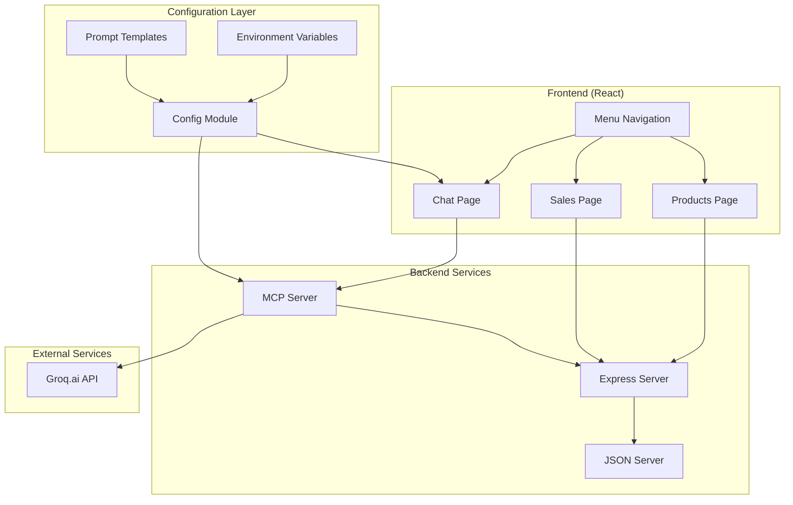

# Design Document

## Overview

O sistema será composto por três componentes principais: um backend Express.js com JSON Server, um servidor MCP para contexto de API, e um frontend React moderno. A arquitetura prioriza modularidade e facilidade de manutenção para ambiente educacional. **TODOS os componentes serão implementados em TypeScript para garantir type safety e melhor experiência de desenvolvimento.**

## Architecture



## Components and Interfaces

### 1. Backend API (Express + JSON Server)

**Express Server (`/backend/server.ts`)**

- Porta: 3001
- Middleware: CORS, JSON parsing, error handling com tipos TypeScript
- Proxy para JSON Server na rota `/api`
- Endpoints customizados para validação e business logic com tipagem forte
- Configuração TypeScript com ts-node para desenvolvimento

**JSON Server (`/backend/db.json`)**

- Estrutura de dados:

```json
{
  "products": [
    {
      "id": 1,
      "name": "string",
      "price": "number",
      "category": "string",
      "description": "string",
      "stock": "number",
      "createdAt": "string"
    }
  ],
  "sales": [
    {
      "id": 1,
      "productId": "number",
      "quantity": "number",
      "totalPrice": "number",
      "customerName": "string",
      "saleDate": "string"
    }
  ]
}
```

**API Endpoints:**

- `GET /api/products` - Lista produtos
- `POST /api/products` - Cria produto
- `PUT /api/products/:id` - Atualiza produto
- `DELETE /api/products/:id` - Remove produto
- `GET /api/sales` - Lista vendas
- `POST /api/sales` - Cria venda
- `PUT /api/sales/:id` - Atualiza venda
- `DELETE /api/sales/:id` - Remove venda

### 2. MCP Server

**Estrutura (`/mcp-server/`)**

```
mcp-server/
├── index.ts          # Servidor principal MCP
├── tools/             # Ferramentas MCP
│   ├── products.ts    # Tools para produtos
│   └── sales.ts       # Tools para vendas
├── config/            # Configurações
│   └── endpoints.ts   # Definições de endpoints
├── types/             # Definições de tipos
│   ├── api.ts         # Tipos da API
│   └── mcp.ts         # Tipos MCP
└── utils/             # Utilitários
    └── api-client.ts  # Cliente para API
```

**MCP Tools:**

- `list_products` - Lista produtos com filtros
- `get_product` - Busca produto específico
- `create_product` - Cria novo produto
- `update_product` - Atualiza produto
- `list_sales` - Lista vendas com filtros
- `get_sale` - Busca venda específica
- `create_sale` - Cria nova venda
- `get_sales_analytics` - Análises de vendas

**Comunicação:**

- Protocolo: MCP via stdio
- Fallback: Server-Sent Events (SSE) se necessário
- Endpoint SSE: `GET /mcp/stream`

### 3. Frontend (React)

**Estrutura (`/frontend/src/`)**

```
src/
├── components/        # Componentes reutilizáveis
│   ├── Layout.tsx     # Layout principal
│   ├── Navigation.tsx # Menu de navegação
│   └── Chat/          # Componentes do chat
├── pages/             # Páginas principais
│   ├── Products.tsx   # Página de produtos
│   ├── Sales.tsx      # Página de vendas
│   └── Chat.tsx       # Página de chat
├── services/          # Serviços de API
│   ├── api.ts         # Cliente REST API
│   └── mcp.ts         # Cliente MCP
├── config/            # Configurações isoladas
│   ├── mcp-config.ts  # Config MCP
│   ├── prompts.ts     # Templates de prompts
│   └── env.ts         # Variáveis de ambiente
├── types/             # Definições de tipos
│   ├── api.ts         # Tipos da API
│   ├── mcp.ts         # Tipos MCP
│   └── components.ts  # Tipos de componentes
└── styles/            # Estilos CSS/SCSS
```

**Design System:**

- Framework: React 18 + Vite + TypeScript
- Styling: Tailwind CSS
- Icons: Lucide React
- State: React Query para cache de API
- Routing: React Router DOM
- Type Safety: TypeScript strict mode com definições completas

### 4. Configuration Module

**Arquivos de Configuração (`/frontend/src/config/`)**

**mcp-config.ts:**

```typescript
export interface MCPConfig {
  serverUrl: string;
  timeout: number;
  retryAttempts: number;
  tools: {
    products: string[];
    sales: string[];
    analytics: string[];
  };
}

export const mcpConfig: MCPConfig = {
  serverUrl: process.env.REACT_APP_MCP_SERVER_URL || "",
  timeout: 30000,
  retryAttempts: 3,
  tools: {
    products: ["list_products", "get_product", "create_product"],
    sales: ["list_sales", "get_sale", "create_sale"],
    analytics: ["get_sales_analytics"],
  },
};
```

**prompts.ts:**

```typescript
export interface SystemPrompts {
  default: string;
  antiHallucination: string;
  productQueries: string;
  salesQueries: string;
}

export const systemPrompts: SystemPrompts = {
  default: "Você é um assistente especializado em vendas e produtos...",
  antiHallucination: "Sempre baseie suas respostas nos dados reais da API...",
  productQueries:
    "Para consultas sobre produtos, use as ferramentas disponíveis...",
  salesQueries:
    "Para consultas sobre vendas, acesse os dados através das ferramentas...",
};
```

## Data Models

### Product Model

```typescript
interface Product {
  id: number;
  name: string;
  price: number;
  category: string;
  description: string;
  stock: number;
  createdAt: string;
}
```

### Sale Model

```typescript
interface Sale {
  id: number;
  productId: number;
  quantity: number;
  totalPrice: number;
  customerName: string;
  saleDate: string;
  product?: Product; // Populated via join
}
```

### MCP Message Model

```typescript
interface MCPMessage {
  role: "user" | "assistant";
  content: string;
  timestamp: string;
  tools?: MCPToolCall[];
}
```

## Error Handling

### Backend Error Handling

- Middleware de erro global no Express com tipos TypeScript
- Validação de dados com Zod para type safety
- Logs estruturados com Winston e tipos customizados
- Status codes HTTP apropriados com enums tipados

### MCP Server Error Handling

- Try-catch em todas as tool functions
- Timeout handling para chamadas de API
- Fallback para SSE em caso de falha MCP
- Error reporting para debugging

### Frontend Error Handling

- Error boundaries para componentes React
- Toast notifications para erros de API
- Loading states e skeleton screens
- Retry mechanisms para falhas de rede

## Testing Strategy

### Backend Testing

- Unit tests para endpoints com Jest
- Integration tests para JSON Server
- API contract testing

### MCP Server Testing

- Unit tests para MCP tools
- Mock da API backend
- Integration tests com protocolo MCP

### Frontend Testing

- Component tests com React Testing Library
- E2E tests com Playwright
- Visual regression tests

## Deployment and Development

### Development Setup

```bash
# Backend
cd backend && npm install && npm run dev

# MCP Server
cd mcp-server && npm install && npm start

# Frontend
cd frontend && npm install && npm run dev
```

### Environment Variables

```env
# Backend
PORT=3001
JSON_SERVER_PORT=3002

# Frontend
REACT_APP_API_URL=http://localhost:3001
REACT_APP_MCP_SERVER_URL=http://localhost:3003
REACT_APP_GROQ_API_KEY=your_groq_key_here
```

### Production Considerations

- Docker containers para cada serviço
- Nginx como reverse proxy
- PM2 para process management
- Environment-specific configs
