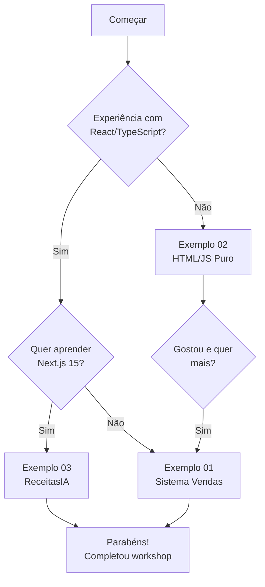

# 🎓 Workshop FATEC - Inteligência Artificial + Model Context Protocol (MCP)

> **Workshop educacional completo sobre integração de IA com sistemas reais usando MCP**

[](https://modelcontextprotocol.io/)
[](https://nodejs.org/)
[](https://www.typescriptlang.org/)

---

## 📚 Sobre Este Repositório

Este repositório contém **3 exemplos progressivos** que ensinam como integrar Inteligência Artificial com aplicações reais usando o **Model Context Protocol (MCP)**.

Cada exemplo foi desenvolvido para diferentes níveis de complexidade e contextos educacionais:

| Exemplo | Tema | Stack | Complexidade | Duração Workshop |
|---------|------|-------|--------------|------------------|
| **[exemplo_01](./exemplo_01/)** | 🛒 Sistema de Vendas | React + TS + Express + JSON Server | ⭐⭐⭐⭐⭐ | 6-8 horas |
| **[exemplo_02](./exemplo_02/)** | 📦 Produtos Simples | HTML/JS Vanilla + Express | ⭐⭐ | 2-4 horas |
| **[exemplo_03](./exemplo_03/)** | 🍳 Receitas com IA | Next.js 15 + Neon PostgreSQL | ⭐⭐⭐⭐ | 4-6 horas |

---

## 🎯 Objetivos de Aprendizado

Ao completar estes workshops, os alunos aprenderão:

- ✅ **Fundamentos de IA**: Como LLMs funcionam e quando usá-los
- ✅ **Model Context Protocol (MCP)**: Protocolo padrão para IA ↔ Ferramentas
- ✅ **Function Calling**: Como IA decide e executa ações
- ✅ **Anti-Alucinação**: Técnicas para prevenir dados inventados
- ✅ **Integração Real**: Conectar IA com databases e APIs
- ✅ **Boas Práticas**: Arquitetura, segurança e manutenibilidade

---

## 📦 Exemplos Detalhados

### 🛒 [Exemplo 01: Sistema de Vendas Completo](./exemplo_01/)

**Tema**: Sistema de vendas com gestão de produtos, estoque e chat IA integrado.

**Tecnologias**:
- **Frontend**: React 18 + TypeScript + Tailwind CSS
- **Backend**: Express + JSON Server
- **MCP Server**: 12 ferramentas customizadas
- **IA**: Groq.ai com function calling

**O que o aluno aprende**:
- Arquitetura completa de sistema moderno
- Desenvolvimento de ferramentas MCP customizadas
- Integração profunda entre IA e backend
- React com TypeScript e boas práticas

**Complexidade**: ⭐⭐⭐⭐⭐ (Avançado)

**[📖 Ver documentação completa →](./exemplo_01/README.md)**

---

### 📦 [Exemplo 02: Produtos Ultra-Simples](./exemplo_02/)

**Tema**: Sistema minimalista para aprender conceitos MCP sem complexidade.

**Tecnologias**:
- **Frontend**: HTML + CSS + JavaScript puro (sem build!)
- **Backend**: Express + Mock em memória
- **MCP Server**: 2 ferramentas + 1 resource
- **IA**: Groq.ai com function calling

**O que o aluno aprende**:
- Conceitos fundamentais do MCP
- Como IA decide usar ferramentas
- Arquitetura cliente-servidor básica
- Sem necessidade de React/TypeScript/build

**Complexidade**: ⭐⭐ (Iniciante)

**[📖 Ver documentação completa →](./exemplo_02/README.md)**

---

### 🍳 [Exemplo 03: ReceitasIA com Database Real](./exemplo_03/)

**Tema**: Sistema de receitas com IA consultando PostgreSQL via MCP oficial do Neon.

**Tecnologias**:
- **Frontend**: Next.js 15 + Server Actions + Tailwind CSS
- **Backend**: Express proxy para Neon MCP Server
- **Database**: Neon PostgreSQL (serverless, gratuito)
- **MCP Server**: Neon MCP Server oficial
- **IA**: Groq.ai com function calling

**O que o aluno aprende**:
- Next.js 15 moderno (App Router + Server Actions)
- Database PostgreSQL real na nuvem
- MCP Server oficial (produção-ready)
- IA consultando estrutura e dados do banco
- Dual mode: CRUD manual + Chat IA

**Complexidade**: ⭐⭐⭐⭐ (Intermediário-Avançado)

**[📖 Ver documentação completa →](./exemplo_03/README.md)**

---

## 🚀 Quick Start

### Pré-requisitos Gerais

Antes de começar qualquer exemplo, você precisa:

- ✅ **Node.js 18+** instalado ([download](https://nodejs.org/))
- ✅ **Git** instalado
- ✅ **Token do Groq** ([obter grátis](https://console.groq.com/))
- ✅ Editor de código (VS Code recomendado)

### Como Escolher Qual Exemplo Fazer?



### Instalação Rápida (qualquer exemplo)

```bash
# 1. Clone este repositório
git clone git@github.com:sinkz/workshop-fatec-ia.git
cd workshop-fatec-ia

# 2. Escolha um exemplo
cd exemplo_01  # ou exemplo_02 ou exemplo_03

# 3. Siga o README específico do exemplo
# Cada exemplo tem instruções detalhadas de setup
```

---

## 📖 Documentação por Exemplo

Cada exemplo possui documentação completa em sua pasta:

### Exemplo 01 (Sistema de Vendas)
- 📄 [README.md](./exemplo_01/README.md) - Visão geral e setup
- 📚 [ROADMAP_WORKSHOP.md](./exemplo_01/docs/ROADMAP_WORKSHOP.md) - Plano de aula
- 🏛️ [ARQUITETURA_EDUCACIONAL.md](./exemplo_01/mcp-server/ARQUITETURA_EDUCACIONAL.md) - Conceitos MCP

### Exemplo 02 (Produtos Simples)
- 📄 [README.md](./exemplo_02/README.md) - Visão geral e setup
- 👨‍🏫 [GUIA_PROFESSOR.md](./exemplo_02/GUIA_PROFESSOR.md) - Roteiro para professores
- 🔧 [COMO_FUNCIONA_RESOURCES.md](./exemplo_02/COMO_FUNCIONA_RESOURCES.md) - MCP Resources explicado
- 🧪 [TESTE_INTEGRACAO_MCP.md](./exemplo_02/TESTE_INTEGRACAO_MCP.md) - Testes práticos

### Exemplo 03 (ReceitasIA)
- 📄 [README.md](./exemplo_03/README.md) - Visão geral e setup
- ⚙️ [COMO_RODAR.md](./exemplo_03/COMO_RODAR.md) - Instruções rápidas
- 📚 [ROADMAP_WORKSHOP.md](./exemplo_03/docs/ROADMAP_WORKSHOP.md) - Cronograma 4h
- 👨‍🎓 [CONFIGURACAO_ALUNOS.md](./exemplo_03/docs/CONFIGURACAO_ALUNOS.md) - Guia alunos
- 🔧 [TROUBLESHOOTING.md](./exemplo_03/docs/TROUBLESHOOTING.md) - Solução de problemas

---

## 🎓 Para Professores

### Planejamento de Workshop

**Workshop Curto (2-4 horas)**:
- Use **Exemplo 02** (HTML/JS puro)
- Foco em conceitos fundamentais
- Sem necessidade de build
- Ideal para iniciantes

**Workshop Médio (4-6 horas)**:
- Use **Exemplo 03** (Next.js + Neon)
- Database real + IA
- Tecnologias modernas
- Ideal para intermediários

**Workshop Completo (6-8 horas)**:
- Use **Exemplo 01** (React + TS completo)
- Sistema profissional completo
- 12 ferramentas MCP customizadas
- Ideal para avançados

### Estrutura Sugerida

```
1. Introdução (30min)
   - O que é IA generativa?
   - O que é MCP?
   - Por que usar?

2. Setup (45min)
   - Instalar dependências
   - Configurar tokens
   - Testar ambiente

3. Teoria (1h)
   - Arquitetura do sistema
   - Como IA decide usar ferramentas
   - Anti-alucinação

4. Hands-on (2-3h)
   - Explorar código
   - Modificar prompts
   - Criar novas ferramentas

5. Exercícios (1-2h)
   - Desafios práticos
   - Personalização
   - Debug

6. Conclusão (30min)
   - Q&A
   - Próximos passos
   - Recursos adicionais
```

---

## 🛠️ Stack Tecnológico Geral

### Frontend
| Tecnologia | Exemplo 01 | Exemplo 02 | Exemplo 03 |
|------------|-----------|-----------|-----------|
| Framework | React 18 | HTML/JS Vanilla | Next.js 15 |
| Linguagem | TypeScript | JavaScript | TypeScript |
| Estilo | Tailwind CSS | CSS Puro | Tailwind CSS |
| Build | Vite | Nenhum | Next.js |

### Backend
| Tecnologia | Exemplo 01 | Exemplo 02 | Exemplo 03 |
|------------|-----------|-----------|-----------|
| Framework | Express | Express | Express (proxy) |
| Database | JSON Server | Mock (RAM) | Neon PostgreSQL |
| API | REST | REST | REST |

### MCP & IA
| Tecnologia | Exemplo 01 | Exemplo 02 | Exemplo 03 |
|------------|-----------|-----------|-----------|
| MCP Server | Custom (12 tools) | Custom (2 tools) | Neon Oficial |
| IA Provider | Groq | Groq | Groq |
| Model | llama3-8b-8192 | llama3-8b-8192 | llama-3.3-70b |
| Function Calling | ✅ | ✅ | ✅ |

---

## 🔧 Variáveis de Ambiente

Cada exemplo requer configuração de variáveis de ambiente. Aqui está um resumo:

### Exemplo 01
```env
# Frontend (.env)
VITE_GROQ_API_KEY=seu_token_groq
VITE_API_URL=http://localhost:3001
VITE_MCP_URL=http://localhost:3003
```

### Exemplo 02
```javascript
// Frontend (config.js)
const CONFIG = {
  groq: { token: "seu_token_groq" },
  backend: { url: "http://localhost:3001" },
  mcp: { url: "http://localhost:3003" }
};
```

### Exemplo 03
```env
# Backend (.env)
NEON_DATABASE_URL=postgresql://...
NEON_API_KEY=seu_api_key_neon

# Frontend (.env.local)
NEON_DATABASE_URL=postgresql://...
```

**📝 Nota**: Cada exemplo possui arquivo `.env.example` ou `env-example.txt` como template.

---

## 🐛 Troubleshooting Geral

### Problema: "Token Groq inválido"
**Solução**: 
1. Acesse https://console.groq.com/
2. Crie/copie um novo API Key
3. Cole no arquivo de configuração correto

### Problema: "Porta já em uso"
**Solução**:
```bash
# Windows
netstat -ano | findstr :3000
taskkill /PID <PID> /F

# Linux/Mac
lsof -ti:3000 | xargs kill -9
```

### Problema: "Module not found"
**Solução**:
```bash
# Limpar cache e reinstalar
rm -rf node_modules package-lock.json
npm install
```

### Problema: "MCP Server não conecta"
**Solução**:
1. Verifique se o servidor está rodando
2. Teste manualmente: `curl http://localhost:3003/tools`
3. Veja logs no terminal do MCP Server

---

## 📊 Comparação Rápida

| Critério | Exemplo 01 | Exemplo 02 | Exemplo 03 |
|----------|-----------|-----------|-----------|
| **Duração Setup** | 30min | 5min | 25min |
| **Linhas de Código** | ~2000 | ~300 | ~1500 |
| **Ferramentas MCP** | 12 | 2 | 23 (Neon) |
| **Database** | JSON (arquivo) | Mock (RAM) | PostgreSQL (cloud) |
| **Build Necessário** | ✅ Sim | ❌ Não | ✅ Sim |
| **TypeScript** | ✅ Sim | ❌ Não | ✅ Sim |
| **Para Iniciantes** | ❌ Não | ✅ Sim | ⚠️ Médio |
| **Produção-Ready** | ⚠️ Parcial | ❌ Não | ✅ Sim |

---

## 🤝 Contribuindo

Contribuições são bem-vindas! Este é um projeto educacional open-source.

### Como Contribuir

1. Fork este repositório
2. Crie uma branch: `git checkout -b feature/minha-feature`
3. Commit suas mudanças: `git commit -m 'Adiciona feature X'`
4. Push para a branch: `git push origin feature/minha-feature`
5. Abra um Pull Request

### Ideias de Contribuição

- 📚 Melhorias na documentação
- 🐛 Correção de bugs
- ✨ Novos exemplos ou ferramentas MCP
- 🌍 Traduções para outros idiomas
- 🎨 Melhorias na UI/UX
- 📹 Vídeos tutoriais
- 📝 Mais exercícios práticos

---

## 📄 Licença

Este projeto é licenciado sob a MIT License - veja o arquivo [LICENSE](LICENSE) para detalhes.

---

## 🙏 Agradecimentos

- **[Anthropic](https://www.anthropic.com/)** - Pelo protocolo MCP open-source
- **[Groq](https://groq.com/)** - Por fornecer LLMs rápidos e acessíveis
- **[Neon](https://neon.tech/)** - Por PostgreSQL serverless gratuito
- **[FATEC](https://www.fatec.sp.gov.br/)** - Por inspirar este workshop educacional
- **Comunidade Open Source** - Por compartilhar conhecimento

---

## 📞 Suporte

**Precisa de ajuda?**

1. 📖 Consulte o README do exemplo específico
2. 🔍 Veja a seção de Troubleshooting
3. 💬 Abra uma [Issue](../../issues) no GitHub
4. 📧 Entre em contato: [adicionar email]

---

## 🎉 Começar Agora!

Escolha seu exemplo e comece a aprender:

- 🚀 **Iniciante?** → [Exemplo 02: Produtos Simples](./exemplo_02/)
- 💪 **Intermediário?** → [Exemplo 03: ReceitasIA](./exemplo_03/)
- 🔥 **Avançado?** → [Exemplo 01: Sistema de Vendas](./exemplo_01/)

**Boa sorte e divirta-se aprendendo! 🎓✨**

---

<div align="center">

**Made with ❤️ for FATEC Students**

[🌟 Star this repo](../../stargazers) | [🐛 Report Bug](../../issues) | [💡 Request Feature](../../issues)

</div>

